# Tugas-Pertemuan-2-Pemograman-Web-2-membuat-layout-sederhana

Nama : M. AKMAL AL ABDILAH
 
NIM :312110034
 
KELAS :TI.21.A.1
 
MATKUL : Pemograman Web 2
 

Assalam'mulaikum wr wb. 
 

Di tugas kali ini saya akan membagikan sedikit shering mengenai program membuat layout sederhana menggunakan html dan css, tampa berlama lama lagi saya kan mesering foto hasil output programnya.

# Tugas_Pratikum_1

1. Tampilan program jika di dekstop(komputer)

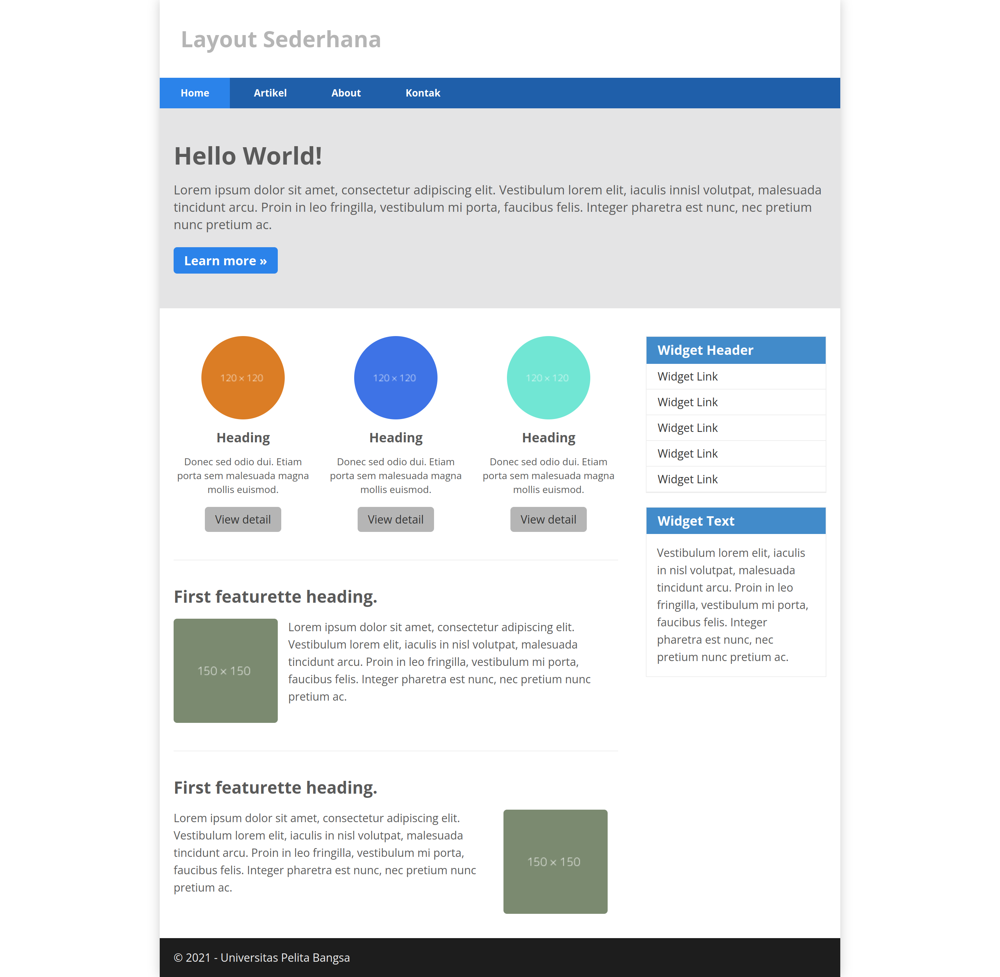
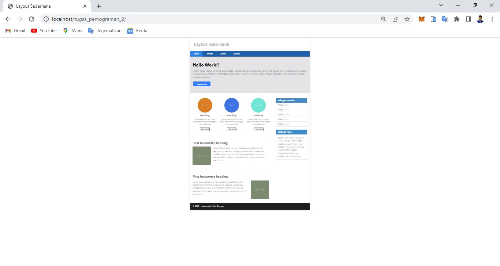

Di atas adalah tampilan program sesuai apa yang di perintahkan contoh prastikum dan di bawah ini adalah tampilan program kreasi saya sendiri.

2. Tampilan program jika di dekstop(komputer)

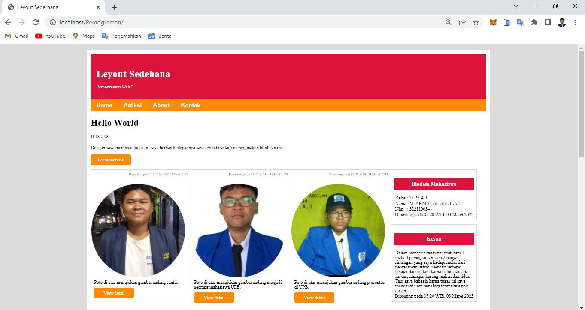
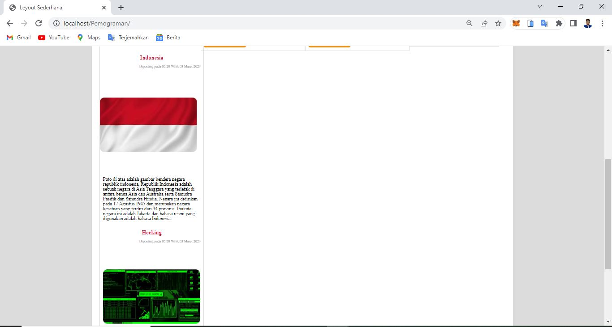
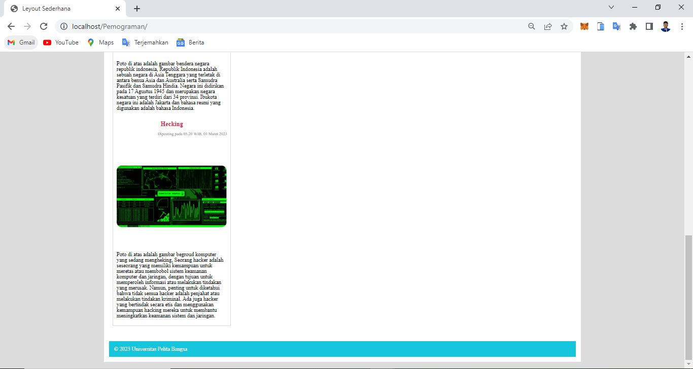

3. Tampilan program jika di mobile(Henpone)

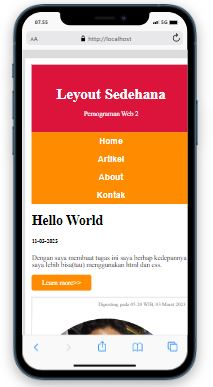

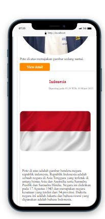
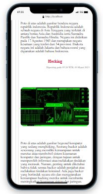!
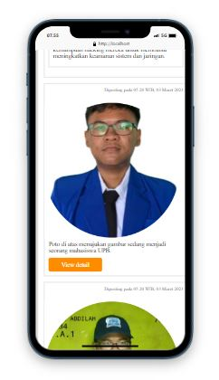
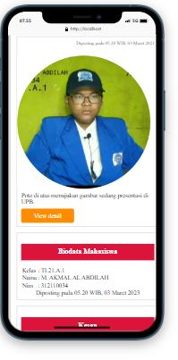
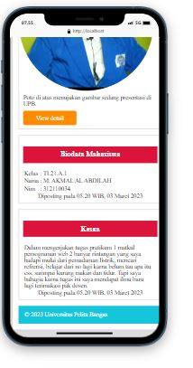

Oke jika kalian penasaran kalian bisa mencobanya langsung dengan scrip coding di file atas untuk file coding1 tampilan outputnya tang paling atas sedangkan file coding2 tampilan oupunta dibawah tampilan output file coding1 dan maaf jika saya belum bisa menjelaskan setep baiytep codingnya karna kurangnya, ilmu saya tapi inssayallah untuk kedepannya saya akan meningkatkannya terimakasih telah membaca hingga titik ini kurang lebih saya mohon maaf.

Assalam'mualaikum wr wb

